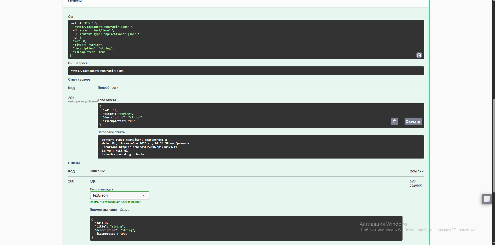
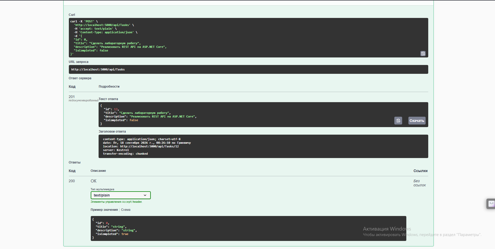
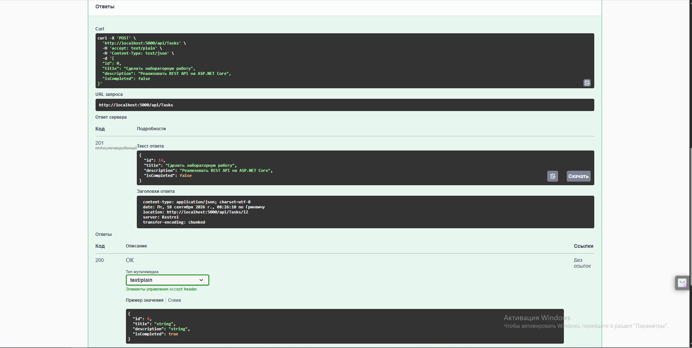
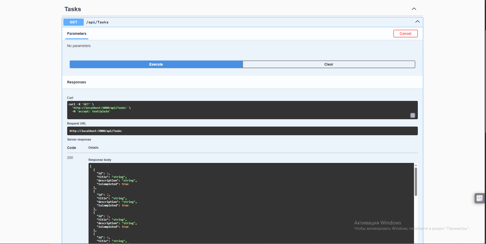
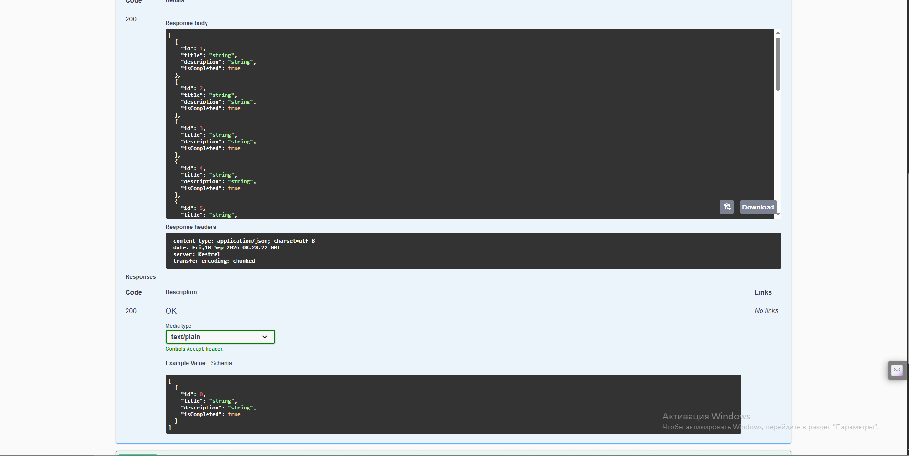
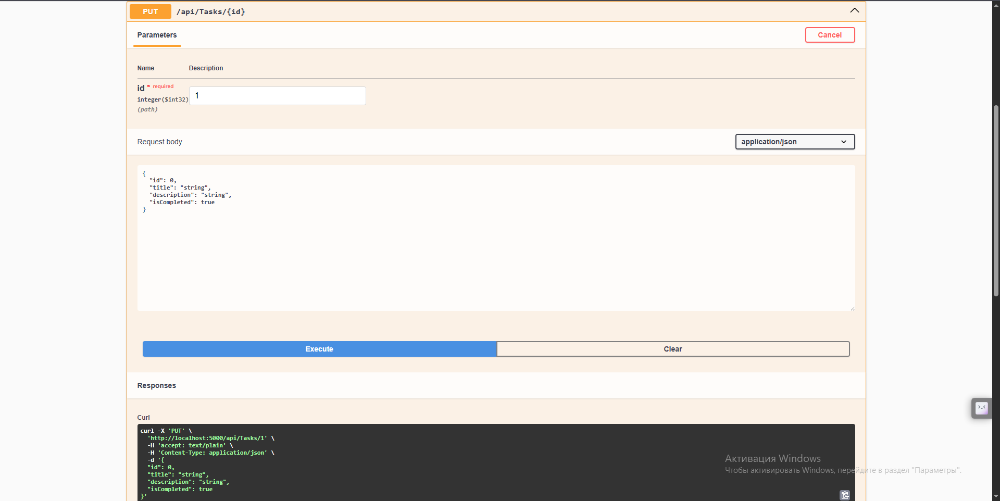
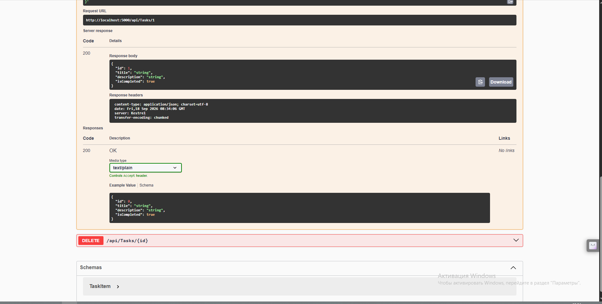
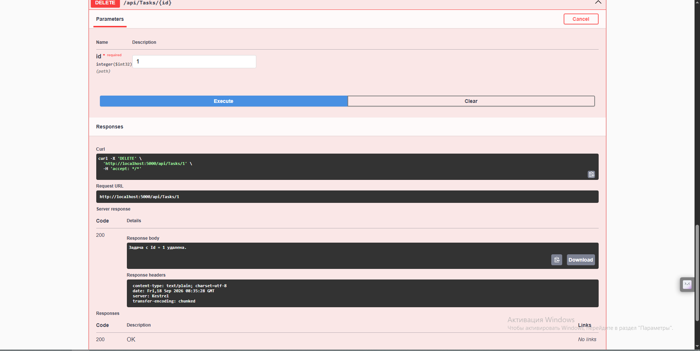

# CSE 5032 — Разработка веб-сервисов
## Модуль 02. Лабораторная работа: REST API на ASP.NET Core

Простой REST API для управления списком задач (`TaskItem`), реализованный на
ASP.NET Core Web API с хранением данных в памяти (`List<TaskItem>`) и
тестированием через Swagger UI.

## Структура проекта

```
TaskManagementApi/
├── Controllers/
│   └── TasksController.cs   # 5 REST-эндпоинтов
├── Models/
│   └── TaskItem.cs          # модель задачи
├── Properties/
│   └── launchSettings.json
├── Program.cs                # регистрация контроллеров и Swagger
├── appsettings.json
├── appsettings.Development.json
└── TaskManagementApi.csproj
```

## Как запустить

Требуется установленный [.NET 8 SDK](https://dotnet.microsoft.com/download).

```bash
cd TaskManagementApi
dotnet restore
dotnet run
```

После запуска Swagger UI откроется автоматически (или перейдите вручную по
адресу `http://localhost:5000/swagger`).

> Если на вашей машине установлен другой SDK (например, .NET 9 или 10),
> просто поменяйте `<TargetFramework>net8.0</TargetFramework>` в файле
> `TaskManagementApi.csproj` на нужную версию — остальной код не изменится.

## Эндпоинты

| HTTP   | Маршрут           | Назначение                    | Успех    | Ошибки        |
| ------ | ----------------- | ------------------------------ | -------- | ------------- |
| GET    | /api/tasks         | Получить все задачи            | 200 OK   | —             |
| GET    | /api/tasks/{id}    | Получить задачу по ID          | 200 OK   | 404 Not Found |
| POST   | /api/tasks         | Добавить новую задачу          | 201 Created | 400 Bad Request |
| PUT    | /api/tasks/{id}    | Изменить существующую задачу   | 200 OK   | 400 / 404     |
| DELETE | /api/tasks/{id}    | Удалить задачу                 | 200 OK   | 404 Not Found |

Пример тела запроса для POST/PUT:

```json
{
  "title": "Сделать лабораторную работу",
  "description": "Реализовать REST API на ASP.NET Core",
  "isCompleted": false
}
```

## Ответы на контрольные вопросы

**Что такое Web API?**
Web API - программный интерфейс, позволяющий приложениям обмениваться
данными через HTTP (обычно в формате JSON). Клиент отправляет HTTP-запрос
к серверу и получает структурированный ответ, независимо от языка или
платформы клиента.

**Для чего используется атрибут [ApiController]?**
Включает поведения, удобные для REST API: автоматическую проверку модели
с возвратом 400 Bad Request при невалидных данных, автоматический вывод
источника параметров (из тела, маршрута или query-строки) и единый формат
ошибок (Problem Details).

**Для чего используется [Route]?**
Задаёт шаблон URL, по которому доступен контроллер или действие. Например,
`[Route("api/[controller]")]` означает, что запросы обрабатываются по пути
`api/Tasks` — имя контроллера подставляется автоматически вместо `[controller]`.

**Чем отличаются методы GET и POST?**
GET получает данные с сервера, не изменяет его состояние, безопасен и
идемпотентен; параметры передаются в URL, тела запроса нет. POST создаёт
новый ресурс или отправляет данные на сервер в теле запроса; метод не
идемпотентен — повторный вызов может создать ещё один ресурс.

**Чем отличаются PUT и DELETE?**
PUT обновляет (полностью заменяет) существующий ресурс данными из тела
запроса. DELETE удаляет ресурс по идентификатору и не содержит тела
запроса. Оба метода идемпотентны - повторный вызов с теми же параметрами
даёт тот же результат.

**Что означают HTTP-коды 200, 201, 400 и 404?**
- **200 OK** - запрос успешно обработан.
- **201 Created** — запрос выполнен, создан новый ресурс.
- **400 Bad Request** — сервер не может обработать запрос из-за
  некорректных данных со стороны клиента.
- **404 Not Found** — запрошенный ресурс не найден на сервере.
## Скриншоты








